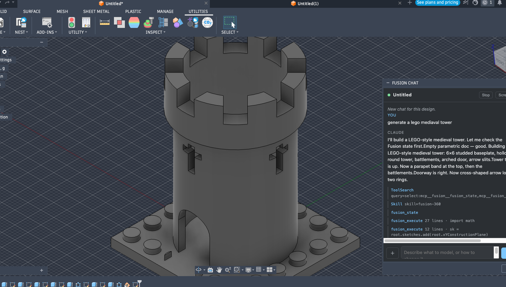
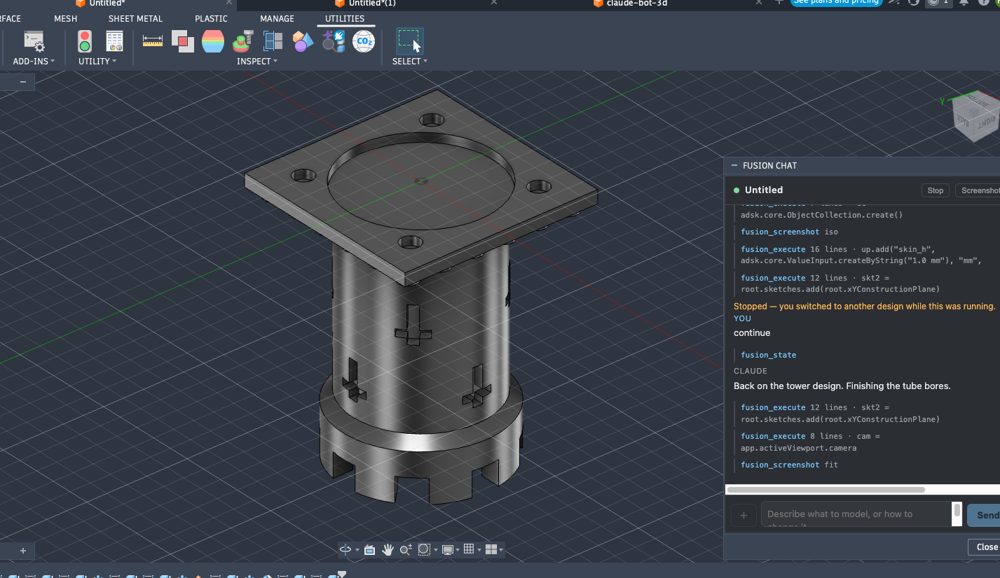
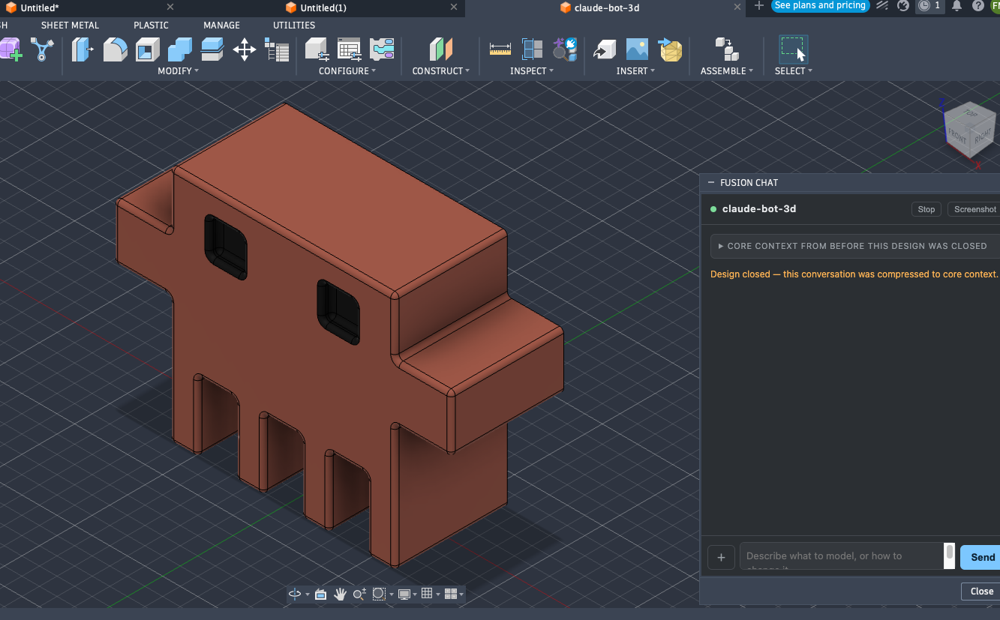
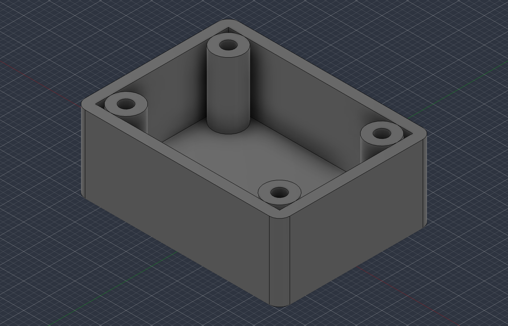
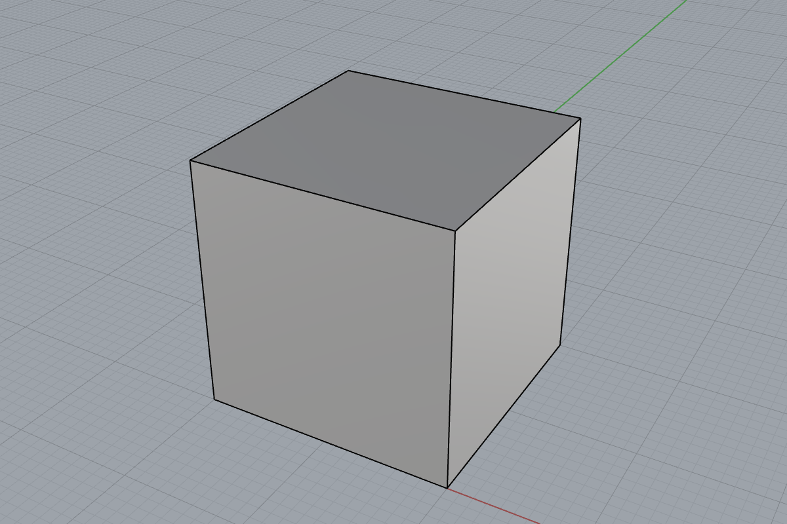

# 3d-mcp

[](https://github.com/francomichetti-dev/3d-mcp/actions/workflows/tests.yml)
[](LICENSE)
[](#requirements)
[](#requirements)

**Model in CAD by prompting.** Claude writes real CAD API Python, runs it inside your live
**Autodesk Fusion** or **Rhino 8** session, *looks at the result through viewport screenshots*,
corrects itself, and hands you print-ready files.

<p align="center">
  
</p>

<p align="center"><em>Six words in. Every line underneath is real Fusion API Python — nothing here is
a preset, and the chat is docked inside Fusion, not a separate app.</em></p>

The screenshot loop is the point. A fixed set of "create box / create hole" tools can never cover a
CAD API, and a model writing CAD code blind gets things subtly wrong — an extrude in the wrong
direction, a profile that grabbed the wrong region — with no exception raised. Arbitrary API access
**plus eyes** turns that into a design → look → correct loop.

> [!WARNING]
> `fusion_execute` runs **arbitrary Python inside your CAD session** with your privileges — not a
> sandbox, and not trying to be one. The only boundary is that both listeners bind `127.0.0.1` and
> require a token generated at install. **Never expose either to a network.** Work in a scratch
> document while you get a feel for it. Read [SECURITY.md](SECURITY.md) before installing.

---

## Install

macOS + Fusion, three steps. (For Rhino, skip to [Rhino 8](#rhino-8) — it installs differently and
needs no `uv`.)

### 1. Clone and run the installer

```sh
git clone https://github.com/francomichetti-dev/3d-mcp.git
cd 3d-mcp
scripts/install.sh
```

That is the whole install: the MCP tools, the docked chat panel and the Fusion knowledge skill. It
is **100% local** — no network calls. Specifically, it

- creates `~/.arges/` (mode 0700) with a random 64-hex-character token (0600),
- symlinks the add-in into Fusion's AddIns folder, so your edits are live,
- links the knowledge skill into `~/.claude/skills/`,
- builds the server and agent virtualenvs with `uv sync`,
- registers the MCP server with Claude Code at user scope, and writes the `/fusion-chat` command.

Everything is registered with **absolute paths**, so it works from any directory and any project.
Re-running is safe and preserves your token; `--rotate-token` replaces it. It refuses to run
anywhere but macOS, naming the platform rather than failing obscurely.

> `install.sh` bakes this checkout's absolute path into the registration. Moving or renaming the
> directory afterwards breaks it — re-run the script from the new location.

### 2. Enable the add-in, once

Fusion cannot enable an add-in from outside, so once, inside Fusion:

> **Utilities → Add-Ins → select `Arges` → Run**
> (older builds put this under **Tools**; `Shift+S` works either way)

It auto-starts on every later launch. **If `Arges` isn't in the list, restart Fusion** — it scans
that folder only at launch.

### 3. Open the chat panel

Either way works, both are idempotent, and each starts the service if it isn't running:

- **In Fusion:** the **Fusion Chat** button under **UTILITIES → ADD-INS**
- **In any Claude Code session, in any project:** `/fusion-chat`

`/fusion-chat --status` reports what is up; `--stop` closes the panel and stops the service.

### Verify

```sh
curl -sS -H "X-Arges-Bridge-Token: $(cat ~/.arges/token)" http://127.0.0.1:7654/health
# {"ok": true, "app_version": "...", "bridge_version": "1", "document": "...", "busy": null}

scripts/fusion-chat.sh --status
```

Set your client's tool timeout above 75 s or it will give up while Fusion is still working — for
Claude Code, `MCP_TOOL_TIMEOUT` (ms) at `120000` or more in `~/.claude/settings.json`:

```json
{ "env": { "MCP_TOOL_TIMEOUT": "120000" } }
```

### Using it without the `claude` CLI

The server imports nothing Claude-specific, so any MCP client works. `install.sh` prints a
ready-to-paste config with the path already filled in:

```json
"mcpServers": {
  "fusion": {
    "command": "uv",
    "args": ["run", "--frozen", "--no-sync",
             "--directory", "/absolute/path/to/3d-mcp/server", "arges-mcp"]
  }
}
```

Claude Desktop keeps that in `~/Library/Application Support/Claude/claude_desktop_config.json`.

Something not working? [`docs/troubleshooting.md`](docs/troubleshooting.md) has the symptom table.

---

## Using it

### The panel

Describe what you want. The header carries the three things you need while it works:

- **Save** — the whole design to your save folder as one `.f3d`, overwritten each press.
- **Download `<FORMAT>`** — one file in the format you picked. The button names the format, so you
  never press it to find out.
- **⚙** — the save folder and the download format. The folder box shows the resolved path rather
  than a blank meaning "the default", because *where did my file go* is the question these buttons
  answer. A folder that cannot be written is refused while the dialog is still open.

Both buttons report the file, its size and its folder as a line in the conversation, and a failure
says so rather than reading as success. Neither needs the model's cooperation — they go straight to
the same bridge and the same export code the tools use.

A **thinking orb** spins in the working banner while a turn runs, and its animation follows what is
actually happening: a dotted outline morphing for sketching, a scan sweep for looking, a scramble
that clicks back for fillets and holes. Stop sits beside it, because the indicator says "running"
and the button is the answer to it.

Three ways to attach a reference photo or a sketch, because a webview inside Fusion may not be
allowed to open a native file picker: the **＋** button, **drag and drop** anywhere on the panel, or
**paste** from the clipboard.

### One chat per design

Each design gets its own conversation, keyed to the document — not one chat that forgets which part
you meant. Switch designs and the transcript switches with it. Switch *mid-turn* and the turn stops
rather than editing the wrong document:

<p align="center">
  
</p>

Close a design and its chat is compressed to the core context a future conversation would need —
what it is for, the decisions and why — instead of being lost or kept whole:

<p align="center">
  
</p>

### From Claude Code

Six tools. `fusion_execute` is the product; the rest exist because every session needs them and
they shouldn't require bespoke code each time.

| Tool | What it does |
| --- | --- |
| `fusion_execute` | Runs Python inside Fusion with `adsk`, `app`, `ui`, `design` injected. The namespace persists across calls, and `screenshot="iso"` returns the viewport *with* the result — one round trip per modelling step instead of two. |
| `fusion_screenshot` | Viewport PNG (`front`, `top`, `right`, `iso`, `fit`) returned as a real image, not base64 text. |
| `fusion_export` | STL / STEP / 3MF / USD / F3D into `~/Documents/arges-exports/`. |
| `fusion_download` | The same, into **your** save folder, in your configured format. |
| `fusion_save` | The whole design as one `.f3d` — and it already ran, see below. |
| `fusion_state` | Document, units, design type, timeline count, parameters, top-level bodies and components. |

A failing script is a **normal result**, not a tool error: the traceback comes back verbatim so
Claude can read it and fix its own code.

<p align="center">
  
</p>

<p align="center"><em>A 40 × 30 × 15 mm enclosure — 2 mm walls, filleted corners, four M3 bosses with
blind pilot bores — built by prompt, verified by measurement, exported to STL.</em></p>

### Saving happens by itself

**Every successful `fusion_execute` saves the design**, with no prompt and nothing for the model to
remember. `ARGES_AUTOSAVE=0` turns it off.

What a save *is* here is deliberate:

> Fusion's own `Document.save()` **returns `True` and saves nothing** when Fusion is in read-only
> mode — which is what an expired subscription does to it. Verified live: no new version, the
> document still dirty, the window title reading *(Expired Subscription — Read Only)*, and `save()`
> reporting success every time. A save that silently does nothing is worse than no save.

So a save here is a **Fusion archive** (`.f3d`) written to your save folder by the export manager —
the whole parametric design in one local file, from a code path that keeps working when saving does
not. One file per document, overwritten: a mirror of the current state, not a pile of snapshots.
Fusion's own ⌘S is untouched and still yours when it works.

---

## Rhino 8

Same four ideas — arbitrary API access, eyes on the viewport, a chat window, no API key. What
differs is *how the code reaches the CAD*.

| | Fusion | Rhino |
| --- | --- | --- |
| Reaching the CAD | an add-in **pushes** work onto the main thread | a timer inside Rhino **pulls** work |
| Mechanism | `registerCustomEvent` / `fireCustomEvent` | `Eto.Forms.UITimer` polling a broker |
| Interface | MCP server + docked palette | MCP server + a separate window |
| Engine | Claude Agent SDK | the `claude` CLI |

**Why Rhino pulls.** Rhino's `InvokeOnUiThread` is *synchronous*, and a `rhinocode` script already
runs on the UI thread — calling it deadlocks against itself. A listener on a background thread
crashes Rhino outright (a thread outliving the script context aborts the embedded CPython). So a
timer inside Rhino asks a loopback broker for jobs and posts results back; being on the UI thread
already, whatever it runs is on the right thread by construction. The marshalling problem
disappears rather than being solved.

```
claude ──MCP──▶ rhino_mcp.py ──HTTP──▶ broker (127.0.0.1:7656) ──▶ poller inside Rhino
```

<p align="center">
  
</p>

<p align="center"><em>The first thing that came back through that chain. A dull picture and the right
test: the prompt reached Rhino, RhinoCommon built real geometry, and the capture travelled back as
an image Claude could look at.</em></p>

**Install it** by asking Claude Code, after cloning and opening Rhino:

```
Set up the Rhino bridge in "<path>/scripts/rhino" — read SETUP.md there and do what it says.
```

`SETUP.md` is written for the agent, not for you: it finds Rhino's Python, registers the MCP server,
starts the broker so it survives the shell, starts the poller, then *proves* it by reading your open
document back to you. `rhino_mcp.py` has **no dependencies** — FastMCP needs Python 3.10+ and Rhino
ships 3.9, so a framework would mean installing a second Python to forward four JSON messages.

> [!WARNING]
> `rhino_execute` runs arbitrary Python inside your Rhino session, exactly as `fusion_execute` does
> for Fusion. Same boundary, same caution — and on Rhino nothing stops to ask before a destructive
> operation.

---

## How it works

```
Claude Code ──┐
              ├── stdio / MCP ──→  server/   (Python, FastMCP)
chat panel ───┘                       │
 (agent/)                             │  HTTP 127.0.0.1:7654 + token
                                      ▼
                              Arges   (Fusion add-in, Python)
                                      │
                                      │  CustomEvent marshal → main thread
                                      ▼
                               Fusion API (adsk.core / adsk.fusion)
```

Fusion has no external API — `adsk.*` exists only inside Fusion, and it is **main-thread-only**. So
the add-in runs an HTTP listener on a background thread and marshals every request onto Fusion's main
thread through a registered custom event, waiting on a per-request event for the reply. One job holds
the main thread at a time; a second concurrent request is refused immediately rather than queued.

The panel talks to the agent service **directly** rather than through the add-in. That is not an
implementation detail: the add-in's main thread is what serves bridge calls, so routing chat through
it would deadlock on the first Fusion tool call.

## The knowledge layer

`skill/fusion-360/` is a Claude Code skill installed alongside the server, and it matters more than
the bridge code. Getting a model to understand *where things go in 3D space* is the hard part.

Every API pattern in it was checked against Autodesk's reference and carries its doc URL. Where a
claim could not be verified it says so, and tells Claude to probe at runtime rather than asserting a
rule — **a plausible-but-wrong pattern is worse than a missing one**. It uses progressive
disclosure: `SKILL.md` (~6 KB) is always in context, and
`references/{patterns,gotchas,spatial,printing,workflow}.md` load on demand.

A sample, all verified against a running Fusion 2704:

- Internal length units are **centimetres** whatever the document displays, and angles are radians.
  20 mm is `2.0`. This is the single most common error.
- `camera.viewOrientation` accepts a value on the camera copy, then is **silently reverted** when the
  camera is assigned back to the viewport. Named views must be set via `eye`/`upVector`.
- Querying faces in the *same* call that created a feature returns **stale topology, and the stale
  read succeeds** — a shell operation silently hollowed a sealed void instead of removing the top
  face, with no exception.
- Exporting to `part.usd` actually writes `part.usd.usdz`, so an existence check on the requested
  path reports a false failure for a successful export.

## Requirements

The two halves are independent — install whichever CAD you use, or both.

**Fusion** (macOS): Fusion installed and launched once; [`uv`](https://docs.astral.sh/uv/) and
`python3` on `PATH`; any MCP client (the `claude` CLI is optional — it only automates registration
and the `/fusion-chat` command). The chat panel additionally needs Claude Agent SDK credentials: a
signed-in `claude` CLI or an `ANTHROPIC_API_KEY`.

**Rhino 8** (Windows or macOS): Rhino 8 opened once with the `ScriptEditor` command run — that is
what builds Rhino's Python; [Claude Code](https://code.claude.com/docs/en/setup) on a Pro, Max or
Team plan. **No API key and no `uv`.** `pywebview` for the chat window only, installed by the
launcher on first run.

## Security

`fusion_execute` runs whatever Python Claude sends, inside Fusion, with your permissions. That is
the entire point, so the channel is gated tightly instead:

- **Loopback only.** Binds `127.0.0.1:7654`, never `0.0.0.0`. No remote or LAN access, ever.
- **Token on every request**, including `/health`, compared with `hmac.compare_digest` *before* the
  body is read. Being a non-safelisted header it is unreachable from a web page: the browser must
  preflight, and the bridge answers no CORS.
- **Fail closed.** No readable token file → the listener does not start, and says why in `addin.log`.
- **Host pinning** against DNS rebinding; a 5 MB request cap; 64 KB caps on stdout and result;
  screenshot dimensions *rejected* outside 64..1920 × 64..1440 rather than silently clamped; 8
  concurrent connections; one execution at a time.
- `~/.arges` is 0700 and its files 0600; the token is never logged.

Exports are confined to `~/Documents/arges-exports/`, attachments to `~/.arges/attachments/`. For
saves and downloads the *folder* is configuration and the *name* is slugged, so a caller supplies a
filename and never a path — `../../etc/passwd` becomes the inert name `.._.._etc_passwd` — and an
existing file is never overwritten. Nothing third-party executes inside the CAD, and the bridge, MCP
server and chat service make no outbound calls; the deliberate exceptions are `uv sync` at install
time and the panel's own calls to Anthropic, which is what makes it a chat.

The full threat model is in [SECURITY.md](SECURITY.md).

## Status

Verified end to end against **Fusion 2704** on macOS: parametric parts built and confirmed by
measurement, STL validated, and every failure path exercised — bad code, wrong token, bad host,
oversized requests, timeouts, reload edge cases.

**Rhino 8 is working and in real use** on Windows, and has been used to model real parts by someone
other than its developer: `rhino_state` reads the live document, `rhino_execute` builds geometry,
`rhino_screenshot` returns a real capture, and the chain carries non-ASCII intact — which cost two
real bugs, since Windows pipes default to cp1252.

The Fusion half is verified on macOS only. Both bridges are plain Python with nothing
platform-specific in them, but `scripts/install.sh` knows only the macOS add-ins path, so
Fusion-on-Windows needs that path adding and a look at the launcher.

## Uninstall

```sh
scripts/uninstall.sh            # add-in symlink, skill link, MCP registration,
                                # /fusion-chat command, and the agent service
scripts/uninstall.sh --purge    # also deletes ~/.arges (token, logs, chats)
```

Exports in `~/Documents/arges-exports/` are never touched.

## Contributing

```sh
tests/run.sh     # offline: no CAD, no network, no API key
```

**1099 assertions across thirteen suites**, none of which need Fusion, Rhino, or an internet
connection. That is a macOS run; on Linux the count is lower because the installer is macOS-only and
`test_install.py` skips those assertions rather than pretending to check them:

| Suite | Covers |
| --- | --- |
| `test_bridge.py` | the Fusion add-in: concurrency, timeouts, hot reload, per-document identity |
| `test_broker.py` | the job queue: single-flight, expiry when a CAD dies mid-job, long-poll wake-up, HTTP auth |
| `test_chat_registry.py` | per-design chats: isolation, resume, compression when a design closes |
| `test_install.py` | the installer: idempotency, token permissions, uninstall |
| `test_mcp_server.py` | the Fusion MCP tools, and where saves and downloads are allowed to land |
| `test_rhino_mcp.py` | the Rhino MCP server: protocol conformance, every failure path, stream hygiene |
| `test_rhino_chat.py` | the Rhino chat window: finding the `claude` CLI, the MCP config it writes, file permissions |
| `test_rhino_memory.py` | per-project memory: one project across incremental saves, cost accumulation, and degrading rather than raising |
| `test_rhino_poller.py` | the poller that runs inside Rhino, against a RhinoCommon stub — above all, that a tick never raises |
| `test_consistency.py` | constants and code duplicated across the two halves, where a mismatch would fail silently |
| `test_docs.py` | that the docs' checkable claims are true: links resolve, counts match, no personal data |
| `test_e2e_chain.py` | the whole Rhino chain as three real processes: MCP server, broker and a stand-in poller |
| `test_panel.js` | the chat panel's own JavaScript against a stub DOM: the plan, the working banner, the file buttons, the orb |

`arges_impl.py` hot-reloads, so the edit loop does not involve restarting Fusion. See
[CONTRIBUTING.md](CONTRIBUTING.md) for the reload endpoint and what review pays attention to, and
[`docs/`](docs/README.md) for the background — the Rhino traps, and the four architectures tried
before the one that worked.

## Credits

The panel's thinking orb is [thinking-orbs](https://github.com/Jakubantalik/Libraries.dev) by Jakub
Antalik (MIT), vendored as `agent/static/thinking-orb-engine.js` with its licence in the file.

Built from scratch, but two projects informed the design and deserve credit:
[ndoo/fusion360-mcp-bridge](https://github.com/ndoo/fusion360-mcp-bridge) (closest in shape —
execute + screenshot, custom-event marshalling, token auth) and
[rahayesj/ClaudeFusion360MCP](https://github.com/rahayesj/ClaudeFusion360MCP), whose most useful
finding was that the *knowledge files* mattered more than the bridge code.
[`docs/reference-notes.md`](docs/reference-notes.md) records what was studied and when — mechanisms
and design ideas only, with no code copied and nothing third-party running inside a CAD.

## License

MIT — see [LICENSE](LICENSE).
